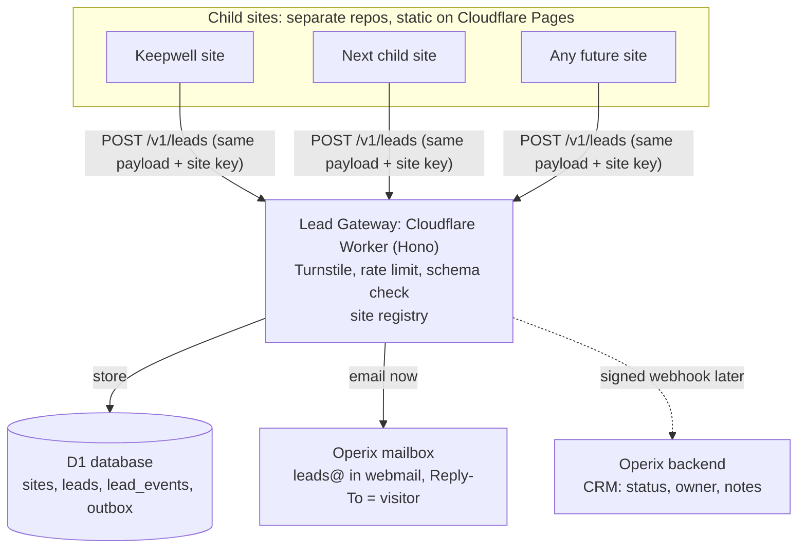

# Operix Child Sites: Keepwell Site & Central Lead Hub Plan

Prepared 2026-09-29. Covers the reference research, the Keepwell site structure, the tech stack, contact-form email, the central lead hub for all Operix child sites, domains and mail, the roadmap and costs. Visual design is tracked separately.

"Keepwell Property Services" is a working name.

## 1. Summary

- Keepwell is a new offline US field-services business under Operix: maintenance, preservation and inspection of homes, carried out by licensed local vendors.
- Its website is a static brochure site. The only moving part is a rarely used quote / vendor form whose submissions must land in Operix webmail.
- Every Operix child site sends form submissions to one shared **Lead Gateway** (a Cloudflare Worker with a D1 database). Today it emails each lead to Operix; later it also forwards each lead to the Operix backend.
- Everything runs on Cloudflare's free plan and nothing pauses when idle, which is why Supabase was ruled out. The only running cost today is the domains.

## 2. What the two reference sites are

Both are the same US field-services model, almost certainly from one operator: a thin brochure site in front of a network of licensed local contractors who do maintenance, preservation and inspection on vacant and occupied homes. They share the same FAQ text word for word.

| | [PrimeVision Services](https://primevisionservice.com/) | [Property Guardians](https://propertyguardians.us/) |
| --- | --- | --- |
| Base | Miami, FL | Ashburn, VA |
| Coverage claimed | 13 states + Washington DC listed | VA, FL, GA, MD (from testimonials) |
| Services | Maintenance, Preservation, Inspection, each with a sub-list | Maintenance, Preservation, Inspection |
| Audiences | Homeowners, buyers and sellers, contractors | Homeowners, contractors |
| Main actions | Request a quote, Become a vendor, Call now | Get started, Get a quote, Call now |
| Contact form | Name, business info, company, email, message, privacy consent | Free quotation form |
| Stack | WordPress + Astra + Elementor Pro, Turnstile + honeypot | WordPress + Astra + Elementor Pro + MetForm |

**How the work runs (from their own copy):**

- Jobs come in as orders and are carried out by licensed, insured local vendors who sign a "vendor package".
- Vendors are paid net 14 by ACH after weekly job completion.
- No fixed price list: each job is quoted at market rate with materials and labour broken out.
- Preservation covers securing and boarding, winterization, debris removal, lawn care, repairs and inspections. Inspection covers pre-listing, pre-purchase, rental, insurance, foreclosure and periodic checks.
- This is the US property-preservation trade: servicers and asset managers send work orders for vacant homes, regional firms dispatch local crews, and photo documentation proves the work.

**Where they are weak (what Keepwell should do better):**

- Placeholder testimonials ("John Doe") and stat counters that render as "0+" cost trust.
- A section headed "Are you a HOMEOWNER?" whose button says "Become a Vendor": the two audiences are tangled.
- Generic copy with grammar slips; one site uses a Gmail address as the business email.
- No proof of process: no sample photo report, response times, licence or insurance details, or service-area pages.
- WordPress + Elementor + plugins for what is a static page: slower, needs constant updates, larger attack surface.

## 3. The Keepwell site

A small static site with two separate doors, one for clients and one for vendors, and proof of process in place of claims.

**Two audiences, never mixed:**

1. **Clients:** asset managers, servicers, property managers, investors and homeowners. Action: request a quote or bid.
2. **Vendors:** licensed local contractors. Action: apply to join the network.

| Page | What it does | Primary action |
| --- | --- | --- |
| Home | Positioning, services, process, proof, coverage, both doors | Request a quote / Join as a vendor |
| Services | Preservation, Maintenance, Inspection with full sub-lists (one page, anchors) | Request a quote |
| How we work | Order → dispatch → photo report → invoice; sample report | Request a quote |
| Coverage | States served; later one page per state for local search | Request a quote |
| Vendors | Trades wanted, requirements (licence, insurance, W-9), pay terms, onboarding steps | Apply |
| Contact | Form, phone, hours (US time zone), email on own domain | Send |
| Privacy, Terms | Required for forms and phone follow-up | — |

**Homepage order:** navigation with phone, hero with both doors, services, process, proof (photo documentation, licensing and insurance, response time), coverage, vendor band, FAQ, contact form, footer.

**Content rules:**

- Every number and claim is real: states, years, response times, licences. No invented testimonials; add reviews only when real clients give them.
- Business email lives on the company domain, never Gmail.
- The quote form and the vendor form are different forms with different fields, but both post to the same lead endpoint (section 6).
- Write the FAQ from scratch; do not reuse the reference sites' text.

## 4. Site tech stack

Each child site is built with Astro as pure static HTML, styled with Tailwind, hosted on Cloudflare Pages, and lives in its own repository.

| Layer | Choice | Why |
| --- | --- | --- |
| Framework | Astro, static output | Layouts and components like a framework; ships plain HTML with no JavaScript unless a component asks for it |
| Styling | Tailwind CSS v4, with the approved design's colors and type as theme tokens | Compiles to plain static CSS, nothing runs in the browser |
| Motion | CSS transitions; GSAP only on pages that earn it, loaded per page | Keeps the default page at near-zero JS |
| Hosting + CI/CD | Cloudflare Pages connected to GitHub | Every push to `main` builds and ships; every branch gets a preview URL (same flow as Vercel). Free, global CDN, never sleeps |
| Forms | A small form script posting to the Lead Gateway (the site's own copy, or the gateway's hosted `client.js`) | Same contract for every site, no shared package to version |
| Spam | Cloudflare Turnstile + honeypot field | Free, no puzzles for real visitors |
| Analytics | Cloudflare Web Analytics | Free, cookieless, no consent banner needed for it |
| Content | Markdown files in the repo | No CMS to host; add one later only if non-developers must edit |

Vercel also runs Astro out of the box, but its free Hobby plan is for non-commercial use, so a business site there would need the paid Pro plan ([Vercel Hobby plan](https://vercel.com/docs/plans/hobby)).

**Separate repos, one shared contract.** Brands never share a look; they share only the lead-form contract.

```
keepwell-web/            Astro + Tailwind site for this business (own repo, own Pages project)
<next-child>-web/        next child site, same pattern, own repo
operix-lead-gateway/     Cloudflare Worker + D1: the central lead hub (own repo)
  contract/              JSON schema for /v1/leads + example payloads
  public/client.js       optional drop-in form script, served at leads.<operix-domain>/v1/client.js
```

Sites import nothing from each other: each one posts its form with a short script of its own, or loads the gateway's `client.js`, which then updates for every site at once. Contract changes ship as `/v2` beside `/v1`, so no site breaks.

## 5. Contact form to webmail, today

The form posts to one Cloudflare Worker that blocks spam, saves the lead in D1 and emails it to the Operix mailbox. Everything runs on Cloudflare's free plan and nothing pauses when idle.

1. The visitor submits the form. JavaScript adds a Turnstile token and a unique request id. Without JavaScript the plain HTML form still posts and is redirected to a thank-you page.
2. The Worker checks the site key and origin, verifies Turnstile, drops honeypot hits, rate-limits by IP and validates the fields.
3. It writes the lead to D1.
4. It emails the lead to a verified Operix address (for example `leads@<operix-domain>`) with Reply-To set to the visitor, so pressing Reply in webmail answers them directly.
5. It returns success; the form shows a confirmation, or inline errors per field.

**Why this and not the alternatives:**

| Option | Verdict |
| --- | --- |
| Supabase free | Rejected. Free projects pause after about 7 days of low activity and need a manual resume; the restore window is 1 year |
| Web3Forms / Formspree | Fine as a stopgap: no code, but leads live in someone else's system, set up site by site |
| PHP mail on shared hosting | Works, but ties sites to cPanel hosting and keeps no central record |
| Worker + Resend | Good if you also want an auto-reply to the visitor: free tier 3,000 emails a month, 3 domains |
| **Worker + D1 + Cloudflare Email Service (chosen)** | Free, never sleeps, keeps every lead, and the same endpoint becomes the central hub |

**Free-plan limits that matter:** Workers Free allows 100,000 requests a day. D1 Free allows 5 million rows read and 100,000 rows written a day with 5 GB storage; past a limit, queries fail until 00:00 UTC rather than the database pausing. Emails to verified destination addresses are free and do not count toward sending quotas. Emailing arbitrary recipients (an auto-reply to the visitor) needs Workers Paid at $5 a month, or Resend.

## 6. Central lead hub for all Operix child sites

Build the Worker as a multi-site Lead Gateway from day one. Every child site posts the same versioned payload with its own site key. When the Operix backend exists, it plugs in behind the gateway and no site changes.

**Framework and hosting:** TypeScript on Cloudflare Workers with [Hono](https://hono.dev/) (a small router built for Workers), D1 for storage, deployed with Wrangler or by connecting the GitHub repo in Cloudflare. No server or VPS to run; it sits on the Workers free plan.

**What D1 is:** Cloudflare's hosted SQL database, built on SQLite. You write normal SQL (tables, joins, indexes) much like MySQL, but there is no server to manage and it never pauses when idle. It suits small workloads like these leads; when Operix has its own MySQL or Postgres, the same tables move over one-to-one.



The sites know one URL and their key. Today leads go to D1 and the mailbox; later the gateway also forwards each lead to Operix.

**The contract (same for every site):**

```
POST https://leads.<operix-domain>/v1/leads
{
  "site_key": "keepwell",
  "form": "quote_request",            // or "vendor_application", "contact"
  "request_id": "<uuid from the browser>",
  "contact": { "name": "", "email": "", "phone": "", "company": "" },
  "fields": {                          // form-specific
    "property_address": "", "state": "GA",
    "services": ["winterization", "lock_change"],
    "message": ""
  },
  "consent": { "privacy": true, "contact_ok": true, "wording_version": "2026-10" },
  "context": { "page": "/contact", "referrer": "", "utm": { "source": "", "campaign": "" } },
  "turnstile_token": ""
}
201 { "lead_id": "ld_...", "status": "received" }
422 { "errors": { "contact.email": "invalid" } }   429 too many requests
```

The same `request_id` sent twice returns the same `lead_id`, so double clicks never create duplicates. The vendor form uses `fields` for trades, states, licence number, insurance and crew size.

**Data model (D1 now; maps one-to-one to Operix's database later):**

| Table | Key columns | Purpose |
| --- | --- | --- |
| sites | key, name, domains, notify_email, webhook_url, webhook_secret, active | Which sites may post, and where their leads go |
| leads | id, site_key, form, status, name, email, phone, company, fields_json, consent_json, context_json, created_at | One row per submission. Status: new, contacted, qualified, won, lost, spam |
| lead_events | id, lead_id, type, data_json, created_at | Audit trail: received, emailed, forwarded, status changed, note |
| outbox | id, lead_id, target, attempts, next_attempt_at, last_error, delivered_at | Retries email and webhook deliveries on a schedule |

**Path to Operix:**

1. Now: gateway + D1 + email. Leads are read in webmail; add a small `/admin` list behind Cloudflare Access if needed.
2. Operix ships an ingest endpoint (any stack; it only needs HTTPS): put its URL and secret in `sites`; the gateway forwards each new lead, HMAC-signed, retried from the outbox.
3. Backfill once with `GET /v1/leads?since=` to load earlier leads into Operix.
4. Operix owns the CRM (status, owner, notes, follow-ups). The gateway stays the public edge, so spam never reaches Operix and no lead is lost while Operix is down.
5. A new child site = one row in `sites` + one Turnstile widget. No backend work.

## 7. Domains, DNS and mailboxes

Put every domain's DNS on Cloudflare, give Operix one real mailbox for leads, and let child domains only forward mail into it.

| Piece | Recommendation | Cost |
| --- | --- | --- |
| DNS | Cloudflare for every domain (Operix and each child) | Free |
| Operix webmail | Zoho Mail Forever Free on the Operix domain: up to 5 users, 5 GB each, one domain, web access only (no IMAP/POP). Move to Zoho Mail Lite if you need phone apps or IMAP | Free |
| Child site addresses | Cloudflare Email Routing on the child domain: `info@` and `quotes@` forward to the Operix mailbox | Free |
| Lead notifications | Worker sends from a verified sending domain to the verified `leads@<operix-domain>` destination | Free |
| Authentication | MX + SPF + DKIM for Zoho on the Operix domain; DKIM for the sending domain; DMARC at `p=none` first, tighten later | Free |

**Setup checklist:**

- [ ] Register the Operix domain and the Keepwell domain; add both to Cloudflare
- [ ] Create the Zoho Mail free organisation on the Operix domain and a `leads@` mailbox (check the free plan is offered in your data centre at signup)
- [ ] Add Zoho's MX, SPF and DKIM records; add a DMARC record
- [ ] Turn on Email Routing for the Keepwell domain; forward `info@` to `leads@` and confirm the destination
- [ ] Onboard a sending domain in Cloudflare Email Service and verify `leads@` as a destination
- [ ] Create a Turnstile widget for the Keepwell domain
- [ ] Create the `operix-lead-gateway` repo; deploy the Worker with D1; add Keepwell to the `sites` table
- [ ] Create the `keepwell-web` repo; connect it to Cloudflare Pages; attach the custom domain; send a test lead

## 8. Roadmap and running costs

Keepwell can go live on free infrastructure long before Operix has a backend.

| Phase | What happens | Gate to move on |
| --- | --- | --- |
| 1. Setup | Domains, Cloudflare DNS, Zoho mailbox, Turnstile | Design approved |
| 2. Build + launch | Astro + Tailwind site, gateway v1 with D1 + email, test leads end to end | First real lead received |
| 3. Harden the hub | Admin list behind Cloudflare Access, outbox retries, onboard a second child site | Operix ingest API ready |
| 4. Operix CRM | Signed webhooks, backfill of old leads, status / owner / notes in Operix | — |

| Item | Cost |
| --- | --- |
| Domains | Registrar price per domain per year (Cloudflare Registrar sells at cost) |
| Cloudflare Pages, Workers, D1, Turnstile, Email Routing, Web Analytics | $0 on the free plan at this volume |
| Zoho Mail Forever Free | $0 |
| Optional: Workers Paid | $5 a month, for auto-replies to visitors and higher limits |
| Optional: Zoho Mail Lite | Per user per month, if you need phone apps or IMAP |

## 9. Open decisions

- [ ] Final business name and domain (Keepwell is a working name)
- [ ] Operix domain for the mailbox and the gateway (`leads.<operix-domain>`)
- [ ] Which states the business really covers today
- [ ] Auto-reply to people who submit? Needs Workers Paid or Resend
- [ ] Vendor documents (W-9, insurance certificate): upload on the form (adds R2 storage) or collect by email after first contact
- [ ] Operix backend stack (anything that can receive an HTTPS webhook works)

## Sources

- PrimeVision Services: [home](https://primevisionservice.com/), [services](https://primevisionservice.com/services/), [what we do](https://primevisionservice.com/what-we-do/)
- Property Guardians: [home](https://propertyguardians.us/), [preservation](https://propertyguardians.us/preservation/)
- [Supabase: free project pausing](https://supabase.com/docs/guides/platform/free-project-pausing)
- Cloudflare Email Service: [pricing](https://developers.cloudflare.com/email-service/platform/pricing/), [limits](https://developers.cloudflare.com/email-service/platform/limits/), [Workers API](https://developers.cloudflare.com/email-service/api/send-emails/workers-api/)
- Cloudflare D1: [pricing](https://developers.cloudflare.com/d1/platform/pricing/), [free-tier enforcement](https://developers.cloudflare.com/changelog/post/2026-09-01-d1-free-tier-limit-enforcement/)
- [Cloudflare Workers pricing](https://developers.cloudflare.com/workers/platform/pricing/)
- [Resend pricing](https://resend.com/docs/knowledge-base/what-is-resend-pricing)
- [Zoho Mail pricing](https://www.zoho.com/mail/zohomail-pricing.html)
- [Vercel Hobby plan](https://vercel.com/docs/plans/hobby)
